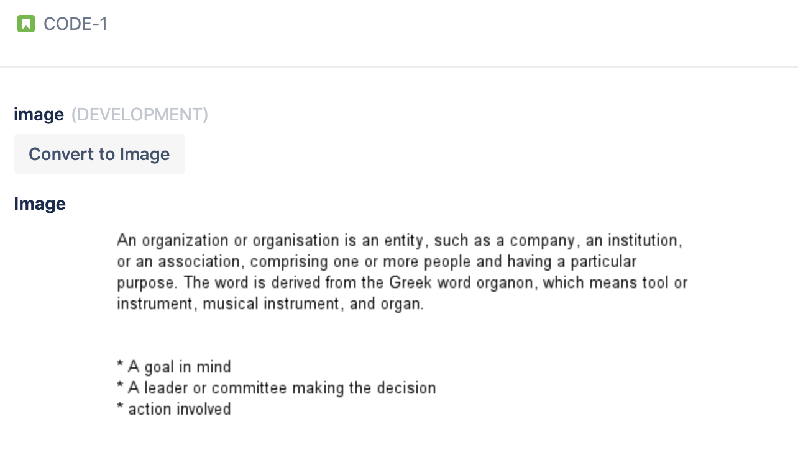
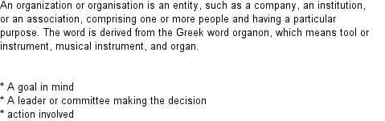

# Text to image app

This project contains a Forge app written in Javascript that converts the text in the description of the JIRA ticket to an Image. 

## Requirements

See [Set up Forge](https://developer.atlassian.com/platform/forge/set-up-forge/) for instructions to get set up.

## Quick start

- Clone this repo

- Register this application on your site using:
```
forge register
```

- Install node modules:
```
npm install
```

- Build and deploy your app by running:
```
forge deploy
```

- Install your app in an Atlassian site by running:
```
forge install
```

- Develop your app by running `forge tunnel` to proxy invocations locally:
```
forge tunnel
```

## Demo

#### JIRA Ticket Description:
Let us take an example of a JIRA ticket that has the following description:

An organization or organisation is an entity, such as a company, an institution, or an association, comprising one or more people and having a particular purpose. The word is derived from the Greek word organon, which means tool or instrument, musical instrument, and organ.

- A goal in mind
- A leader or committee making the decision
- action involved
- communication and members.


The app will return the entities (person, country etc) and concepts(events, products etc) and also the type and subtype of the respective topic and its relevance as shown below.
 
 
